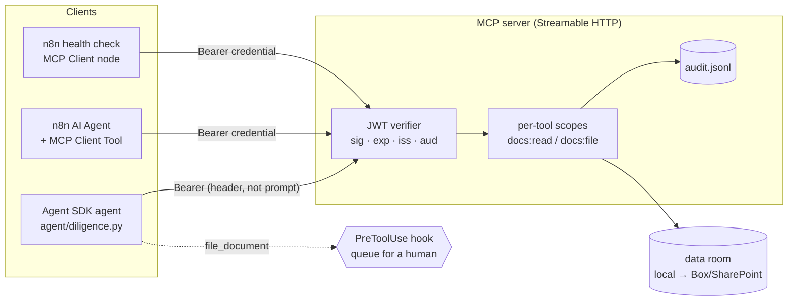

# mcp-diligence-kit

A small, working version of a document-diligence stack: an **MCP server** in front of a data room, a **Claude Agent SDK** agent that answers with page-level citations, an **eval set with a cost line**, and **n8n** workflows that call the same server. Every layer has tests or a smoke run.

The documents in `corpus/` are **synthetic**: a data-center ground lease, a landlord redline, two NDA forms, and a PPA term sheet. The parties and numbers are invented so the stack can run in public.



## How each rule is enforced

| Rule | Where it lives | Proof |
|---|---|---|
| Credentials stay away from the model | The bearer token travels in the MCP client's HTTP header (`mcp_servers.headers` / n8n credential). The backend credential is read only by the server. No tool returns either. | `tests/test_server.py` |
| Real auth, not a shared password | Short-lived JWTs checked for signature, expiry, issuer and **audience** (RFC 8707: a token minted for another server is refused). 401s carry RFC 9728 `resource_metadata` so OAuth clients can discover the auth server. | 3 tests: no token, wrong audience, expired or forged |
| Least privilege | Scopes are checked per tool. The agent's token is `docs:read` only and expires in 15 min. Doc ids come from a fixed index, so no model input reaches a filesystem path. Folders are an allow-list. | `test_write_tool_needs_file_scope`, `test_unknown_doc_and_bad_folder_rejected` |
| Human approval on anything that writes | A `PreToolUse` hook denies `file_document` and queues it in `runs/approvals_pending.jsonl`. It is also absent from `allowed_tools`, and the token lacks the scope. | `test_approval_gate_denies_and_queues`, eval case `write-is-gated` |
| Egress control | `tools=[]`: no shell, no web fetch, no file tools. The only tools are the four read tools on the MCP server. | `agent/diligence.py` |
| Drafts cite their sources | Structured output (JSON schema) requires `doc_id`, `page` and an exact `quote` per finding. After the run, **code** checks each quote against the real page text, so a fabricated citation fails the run. The n8n workflow does the same check in a Code node before anything reaches a human. | `test_verifier_accepts_real_quote_and_rejects_fabrication` |
| Every agent ships with an eval set and a cost line | 10 cases (facts, citations, missing-fact → human review, write gating). Each run appends $ cost, tokens, cache reads/writes, turns and tools called to `runs/costs.jsonl`. | `evals/`, `test_every_gold_fact_and_citation_exists_in_the_corpus` |
| Every call is auditable | One JSONL line per tool call: caller, tool, args, outcome. **No document text**, which is asserted in a test. | `test_audit_log_records_caller_and_outcome` |
| Shared skills | `.claude/skills/diligence-citations/SKILL.md` holds the house rules, loaded by the agent through `setting_sources=["project"]`, so a new agent inherits them without copy-paste. | |

## Run it

```bash
python3 -m venv .venv && .venv/bin/pip install -r requirements.txt
export MCP_JWT_SECRET=$(python3 -c 'import secrets;print(secrets.token_hex(32))')

.venv/bin/python -m pytest -q                      # 16 tests, no model calls
.venv/bin/python server/docs_mcp.py &              # MCP server on 127.0.0.1:8765/mcp
.venv/bin/python agent/diligence.py "Compare the landlord redline v2 against the executed Parcel 7 lease. Which economic terms moved?"
.venv/bin/python evals/run_evals.py --model claude-sonnet-5
.venv/bin/python evals/run_evals.py --model claude-haiku-4-5-20251001   # same cases, cheaper tier
./n8n/smoke_test.sh                                # throwaway self-hosted n8n, no LLM needed
./n8n/webhook_auth_check.sh                        # webhook auth contract: 403 / 403 / 502
```

The agent and evals need a logged-in `claude` CLI or `ANTHROPIC_API_KEY`. Tests and the n8n smoke run need neither.

## n8n

- `n8n/diligence-agent-mcp.json`: Webhook (header auth) → **AI Agent** (Claude + **MCP Client Tool**, read tools only) → extract citations → **MCP Client** node fetches every cited page → Code node verifies each quote → `200 draft` / `422 needs review` / `502 agent failed`. The agent node retries 3× with a 5s wait, then goes down an error branch; it never fails silently.
- `n8n/diligence-mcp-healthcheck.json`: every 15 minutes, call `list_documents` and **assert on the content** (at least one document came back), not on node status.
- `n8n/webhook_auth_check.sh`: installs the agent workflow into a throwaway n8n, publishes it and calls the live webhook. Measured on 2.37.10: **403** with no token, **403** with a wrong token, and **502 `{"status":"error","error":"agent failed after 3 tries"}`** with a valid token and a placeholder model key. The failure is reported, not swallowed.
- `n8n/smoke_test.sh`: imports both workflows and credentials into a throwaway n8n 2.37.10 and runs the health check twice. With a valid token it passes. After rotating the server secret, the error branch fires.

### Two n8n 2.37.10 behaviors worth knowing (#1 reproduced by the smoke run; #2 read from source, not yet reproduced)

1. **A failed node can report success.** The first version used `{{ $env.DILIGENCE_MCP_URL }}` for the endpoint. n8n 2.x blocks `$env` in expressions by default (`N8N_BLOCK_ENV_ACCESS_IN_NODE`). With `onError: continueErrorOutput`, an error thrown while resolving a node parameter, *before* the per-item loop, sent the input item down the **success** output. The execution status was `success` and it ended on the "Healthy" node. The MCP call never happened: the node failed while resolving its endpoint URL, before it opened a connection. That is why the health check now asserts on returned content.
2. **Retry only inspects the first item.** `workflow-execute.js` decides whether to retry with `data[0][0].json.error`. With `continueErrorOutput`, a batch where item 1 succeeds and item 2 fails is not retried.

## What's here and what isn't

- **Auth** uses HS256 with a local mint script (`scripts/mint_token.py`) standing in for the authorization server. In production the verifier takes the IdP's JWKS (Entra ID or Okta, RS256) and keeps the same checks. The `MCPServer(auth=AuthSettings(...))` wiring already publishes protected-resource metadata for OAuth discovery.
- **Store**: the local markdown store stands in for Box. A Box backend replaces `load_corpus`/`get_doc`, and the Box token stays server-side.
- **Search** is keyword scoring, which is enough for a five-document room. A real data room needs hybrid search, and then the eval set grows before anything else changes.
